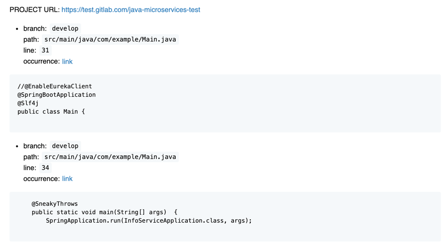

# gitlab-global-search

 node.js script which provides a possibility to search over all GitLab repositories files for some 
 search term. Based on usage of native GitLab API.

## Used dependencies
+ requests 
+ fs 

## Setting up the project
```shell
npm i
```

## Running the script 

```shell
node gitlab-search.js --search=<search-term> --repo=https://test.gitlab.com --access-token=<acc-token> --raw --cache-repos
```

where
+ `search` — search term;
+ `repo` — GitLab URL;
+ `access-token` — Access token for your GitLab account;
+ `raw` — (Optional) Determines the way of writing the report data: in raw `.txt` file or in `.md` file.
+ `cache-repos` — (Optional) If enabled, stores fetched repositories in a separate file in `output/repos.json`.

To avoid inputting the data about the repo and access token, those data can be stored as environment 
variables under the `REPO` and `ACCESS_TOKEN` keys. </br>

So, basically for IntelliJ configuration can look as follows.


### Result of script 

After starting the script you will be able to see the console output of running the program: 
```shell

   ____ _ _   _       _         ____                      _     
  / ___(_) |_| | __ _| |__     / ___|  ___  __ _ _ __ ___| |__  
 | |  _| | __| |/ _` | '_ \    \___ \ / _ \/ _` | '__/ __| '_ \ 
 | |_| | | |_| | (_| | |_) |    ___) |  __/ (_| | | | (__| | | |
  \____|_|\__|_|\__,_|_.__/    |____/ \___|\__,_|_|  \___|_| |_|
                                                                           v 1.0.1                                     

============== START PROJECTS FETCHING ==============
Caching enabled. Read 28 projects from cache file
========= START SEARCHING OVER THE PROJECTS =========
Done. 2 matching projects have been written to result.txt file

```

### Output data

After running the script you will be able to check the report in the way that you've selected using `--raw` 
parameter. Both `result.md` and `result.txt` files will be available in `output` directory. <br/>

#### Case: search term _dependency_

Example of `result.txt` file (when `raw` parameter was provided):

```shell
PROJECT URL: https://test.gitlab.com/java-microservices-test
- branch: develop
  path: src/main/java/com/example/Main.java
  line: 31
- branch: develop
  path: src/main/java/com/example/Main.java
  line: 34
```
Example of `result.md` file:



## Caching
As  [mentioned before](#Running-the-script) you can store fetched GitLab repositories in a cache 
file to avoid repeating fetching info of repos before each search. After you provide `--cache-repos` 
parameter during the first time script will work as usual. When you will try to run it once more, you 
will notice in console that now it uses cache file for getting the info about the repos. This file will 
be located in the `output` directory under the `repos.json` name. <br/>
Here goes an example of such file:
```shell
[{"id":1,"web_url":"https://test.gitlab.com/java-microservices-test"}]
```

## Final: Inspiration of the project
I suppose all of us, Software Engineers, at least once faced the situation when there was a need to search
over GitLab projects not for some specific repo, but for some code inside all the repos. Interesting fact
that by default GitLab provides only the possibility to search over only one specific project and searching 
over all project requires involving of SysAdmins DevOps and other magic guys to configure GitLab server with 
such features as Elasticsearch and Advanced Search while the feature seems like from the category 
of out-of-the-box ones. Even ancient SVN provides such possibility by default, just imagine! 
So, the idea of that script was to provide as much as easy way to short your time
while searching for some code snippets over your huge GitLab with a plenty of Repositories. Project is open
for any ideas and adjustments, so feel free to create some issues, MRs and so on. Good Luck and enjoy!